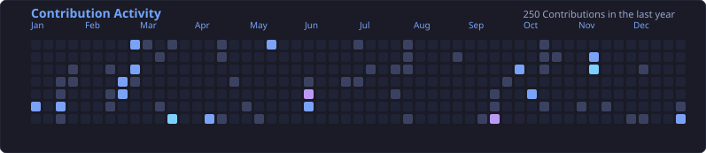
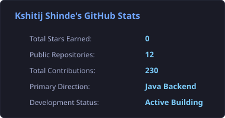
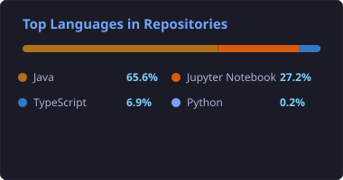

<table>
  <tr>
    <td width="220" align="center" valign="middle">
      
    </td>
    <td valign="middle">
      <h1>👋 Hi, I'm Kshitij Shinde</h1>
      <h3>☕ Java Backend Developer</h3>
      <p><b>Third Year IT Engineering Student</b> &bull; <i>Sanjivani College of Engineering, Kopargaon</i></p>
      <p>I build backend applications using Java and Spring Boot, design REST APIs, work with databases and security, and continuously improve my problem-solving skills through DSA.</p>
      <p><i>&ldquo;Turning ideas into reliable backend solutions.&rdquo;</i></p>
      <p>
        <a href="https://github.com/KshitijShinde26"></a>
        <a href="https://www.linkedin.com/in/kshitijshinde26/"></a>
        <a href="https://leetcode.com/u/kshitu_26/"></a>
        <a href="mailto:kshitij26gs@gmail.com"></a>
      </p>
    </td>
  </tr>
</table>

```java
public class Backend_Developer {
    public static void main(String[] args) {
        build();
        learn();
        improve();
        repeat();
    }
}
```

---

### ⚡ Quick Overview

<table>
  <tr>
    <td width="50%">
      🎓 <b>Third Year IT Engineering Student</b><br/>
      <sub>Learning &bull; Building &bull; Growing (Sanjivani COE)</sub>
    </td>
    <td width="50%">
      💻 <b>Java Backend Development</b><br/>
      <sub>APIs &bull; Databases &bull; Spring Security</sub>
    </td>
  </tr>
  <tr>
    <td width="50%">
      🧠 <b>Problem Solver</b><br/>
      <sub>DSA &bull; LeetCode &bull; Java Algorithms</sub>
    </td>
    <td width="50%">
      🚀 <b>Real Projects</b><br/>
      <sub>Building Practical Server-Side Applications</sub>
    </td>
  </tr>
</table>

---

## ⚙️ Tech Stack

<div align="center">

| Domain | Technologies & Frameworks |
| :--- | :--- |
| **Languages** |   |
| **Backend** |       |
| **Databases & ORM** |     |
| **Tools & Ecosystem** |     |

</div>

---

## 🚀 Featured Project

### 🛒 [Surplus Food Marketplace Backend](https://github.com/KshitijShinde26/Surplus_Food_MarketPlace_Project)
> **An enterprise-style Java Spring Boot backend for a surplus food marketplace connecting food providers, consumers, and NGOs to minimize food waste.**

```text
HTTP / WebSocket Requests
          │
          ▼
[ Spring Security Filter Chain ] ──► Stateless JWT Auth & SecurityContext (RBAC)
          │
          ▼
[ DispatcherServlet & Spring MVC ] ──► JSR-380 Validation & REST Routing
          │
          ▼
[ Service & Business Logic Tier ] ──► MapStruct Entity/DTO Mapping & Event Dispatch
          │
          ├──► [ Real-Time Notifications ] ──► Spring WebSocket & STOMP Broker
          └──► [ Persistence Layer ] ──► Spring Data JPA & Hibernate ORM (HikariCP)
                     │
                     ▼
              [ MySQL Database ] ──► InnoDB Engine (ACID Transactions)
```

#### 🔑 Backend Architecture & Highlights:
- **Core Stack:** **Java 21** & **Spring Boot 3.3.5** with multi-tier architecture (Controllers, Services, Repositories, DTOs, Mappers).
- **Security & Authorization:** Sessionless **JWT** filter chain with Spring Security implementing role-based access control (`ROLE_CONSUMER`, `ROLE_BUSINESS`, `ROLE_NGO`, `ROLE_ADMIN`).
- **Data Persistence:** Relational schema design on **MySQL** with **Spring Data JPA / Hibernate**, featuring transactional boundaries (`@Transactional`) and connection pooling.
- **Real-Time & Events:** Event-driven architecture with `ApplicationEventPublisher` and **WebSockets / STOMP** for live notification alerts.
- **Service Integrations:** Location-based listing search, MapStruct DTO mappers, Jakarta Validation (`JSR-380`), and Actuator health endpoints.

👉 **[View Repository →](https://github.com/KshitijShinde26/Surplus_Food_MarketPlace_Project)** &nbsp;|&nbsp; 🌐 **[Live App Preview →](https://surplus-food-market-place-project.vercel.app)**

---

## 📊 Coding & Problem Solving

I regularly practice Data Structures and Algorithms using **Java**, sharpening algorithmic thinking and space-time optimization.

<div align="center">

[](https://leetcode.com/u/kshitu_26/)
[](https://github.com/KshitijShinde26/LeetCode)

</div>

### 📂 Problem Solving Repositories:
- **[LeetCode Solutions (Java)](https://github.com/KshitijShinde26/LeetCode)** — Java solutions to coding and algorithmic problems covering arrays, two pointers, trees, and dynamic programming.
- **[Apna College Data Structures](https://github.com/KshitijShinde26/Apna_College_Data_Structure)** — Core implementations of stacks, queues, linked lists, trees, recursion, and sorting algorithms in Java.
- **[College Data Structures](https://github.com/KshitijShinde26/College_Data_Structure)** — Academic coursework, lab implementations, and foundational problem sets in Java.
- **[Udemy Data Structures in Java](https://github.com/KshitijShinde26/Udemy_Data_Structure_Java)** — Structured exercises focusing on linear and hierarchical data structures.

---

## 📁 Other Projects

*Client-side and supporting applications built to consume backend APIs:*

- 🧁 **[Payel's Bakery Cottage](https://github.com/KshitijShinde26/Payel-s_Bakery_Cottage)** — Full-stack bakery ecommerce web application built with TypeScript, showcasing product catalogs and order flows.
- 💼 **[Portfolio](https://github.com/KshitijShinde26/Portfolio)** — Personal portfolio web presence built with TypeScript and deployed on Vercel.
- 🎮 **[Game](https://github.com/KshitijShinde26/Game)** — Interactive software build built with TypeScript.

---

## 📚 Practice & Course Repositories

*Foundational repositories documenting structured coursework and core Java practice:*

- **[Java_Course](https://github.com/KshitijShinde26/Java_Course)** — OOP principles, interfaces, polymorphism, and collections in Java.
- **[Udemy_Java_Basic](https://github.com/KshitijShinde26/Udemy_Java_Basic)** — Core Java syntax, exception handling, and object modeling practice.
- **[Full_Stack_Course](https://github.com/KshitijShinde26/Full_Stack_Course)** — Full stack backend modules and service integration exercises in Java.
- **[Udemy_Data_Structure_Java](https://github.com/KshitijShinde26/Udemy_Data_Structure_Java)** — Course-driven data structure practice and algorithms.

---

## 📈 GitHub Activity

<div align="center">

<a href="https://github.com/KshitijShinde26">
  
</a>

<br/><br/>

<a href="https://github.com/KshitijShinde26">
  
</a>
<a href="https://github.com/KshitijShinde26">
  
</a>

<br/><br/>

<a href="https://github.com/KshitijShinde26">
  
</a>

<p><sub><i>Note: Language distribution reflects client-side UI code in supporting projects; primary engineering focus is Java Backend Development.</i></sub></p>

</div>

---

## ⚡ Recent Activity

- 🛒 **Surplus Food Marketplace Backend:** Developed REST endpoints for multi-tier food listings, integrated Spring Security stateless JWT filter chain, implemented transaction pooling, and configured WebSockets for live alerts.
- 🧩 **Java Problem Solving:** Continuously solving algorithm and data structure problems in [LeetCode](https://github.com/KshitijShinde26/LeetCode) using Java.
- 📚 **Data Structures Implementation:** Maintained linear and hierarchical data structure implementations in [Apna_College_Data_Structure](https://github.com/KshitijShinde26/Apna_College_Data_Structure).

---

## 🗂️ Repository Showcase

| Category | Repositories |
| :--- | :--- |
| **Java / Backend** | &bull; [Surplus_Food_MarketPlace_Project](https://github.com/KshitijShinde26/Surplus_Food_MarketPlace_Project)<br/>&bull; [Java_Course](https://github.com/KshitijShinde26/Java_Course)<br/>&bull; [Udemy_Java_Basic](https://github.com/KshitijShinde26/Udemy_Java_Basic)<br/>&bull; [Full_Stack_Course](https://github.com/KshitijShinde26/Full_Stack_Course) |
| **DSA / Problem Solving** | &bull; [LeetCode](https://github.com/KshitijShinde26/LeetCode)<br/>&bull; [Apna_College_Data_Structure](https://github.com/KshitijShinde26/Apna_College_Data_Structure)<br/>&bull; [College_Data_Structure](https://github.com/KshitijShinde26/College_Data_Structure)<br/>&bull; [Udemy_Data_Structure_Java](https://github.com/KshitijShinde26/Udemy_Data_Structure_Java) |
| **Other Projects** | &bull; [Payel-s_Bakery_Cottage](https://github.com/KshitijShinde26/Payel-s_Bakery_Cottage)<br/>&bull; [Portfolio](https://github.com/KshitijShinde26/Portfolio)<br/>&bull; [Game](https://github.com/KshitijShinde26/Game) |

---

## 🏆 Achievements & Certifications

- 🎓 **Bachelor of Engineering in Information Technology (Third Year)** &bull; *Sanjivani College of Engineering, Kopargaon*
- 📜 **Java Backend Development Track** &bull; *Building my collection of certifications, projects, and milestones.*

---

## 🤝 Connect With Me

<div align="center">

[](https://www.linkedin.com/in/kshitijshinde26/)
[](https://leetcode.com/u/kshitu_26/)
[](https://github.com/KshitijShinde26)
[](mailto:kshitij26gs@gmail.com)

<br/>

*&ldquo;Consistent effort builds extraordinary results.&rdquo;*

</div>
